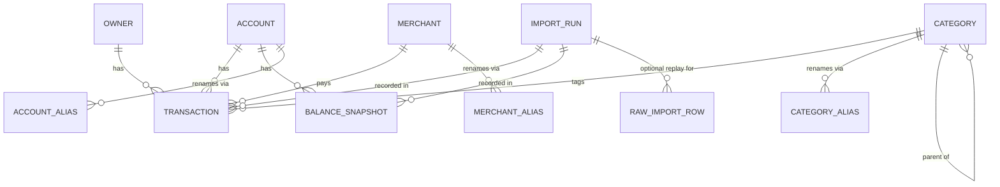

# Data model

Schema for the `monarch_ingest` layer (shared with `monarch_cfo`). See
[plan.md §2](plan.md) for the high-level rationale; this file is the
table-by-table reference the importer and API contracts build on.

All amount/balance values are **integer cents** — never `Float` or
`Numeric` on the hot path. This eliminates rounding drift on re-import
and makes the dedup hash exact.

## Entity-relationship overview

## Tables

### `owner`

Household members. Populated lazily by the importer with `--accept-new`;
values are per-user (e.g. `Alice`, `Bob`, `Shared`). No aliasing —
households don't rename people.

| column | type | notes |
| --- | --- | --- |
| `id` | PK int | |
| `name` | str, UNIQUE | |

### `account`

One row per financial account. Names are captured as the operator
first sees them; subsequent Monarch renames are tracked via
`account_alias`.

| column | type | notes |
| --- | --- | --- |
| `id` | PK int | |
| `monarch_name` | str, UNIQUE | Original display name. Preserved across renames for historical reference. |
| `display_name` | str? | Operator override (optional). |
| `institution` | str? | |
| `mask` | str?, non-unique, indexed | Last-N digits from `"(...NNNN)"`. Non-unique: Monarch ships joint cards with the same last-4 under different names. Used as a rename hint (matched only when exactly one account has that mask). See [ADR-0007](decisions/0007-account-identity-and-content-hash.md). |
| `type` | str? | `checking`, `savings`, `credit_card`, `brokerage`, `real_estate`, … |
| `is_active` | bool | |
| `is_manual_valuation` | bool | `True` for accounts with no mask, e.g. rental property booked at book value. |
| `first_seen` / `last_seen` | date? | Populated by the importer over time. |

### `account_alias`

Captures every raw `Account` string Monarch has ever shipped for an
account, so a rename doesn't create a duplicate row. Resolution order
in the importer: **alias → canonical name → unique-mask hint →
unmatched** (or create, with `--accept-new`). The unique-mask hint
only fires when exactly one existing account has that mask — joint
cards with a shared last-4 must be disambiguated by name. See
[ADR-0007](decisions/0007-account-identity-and-content-hash.md).

| column | type | notes |
| --- | --- | --- |
| `id` | PK int | |
| `account_id` | FK → account | |
| `raw_name` | str | |
| `seen_at` | datetime(tz) | |
| — | UNIQUE | `(account_id, raw_name)` |

### `category`

Transaction category. Supports a one-level hierarchy via
self-referential `parent_id`; subcategories point at their parent.

| column | type | notes |
| --- | --- | --- |
| `id` | PK int | |
| `name` | str, UNIQUE | |
| `parent_id` | FK → category? | Self-referential for subcategory nesting. |
| `active` | bool | Operator-side soft-delete flag; historical transactions keep their category reference. |

### `category_alias`

| column | type | notes |
| --- | --- | --- |
| `id` | PK int | |
| `category_id` | FK → category | |
| `raw_name` | str | |
| — | UNIQUE | `(category_id, raw_name)` |

Diverges from `account_alias` by omitting `seen_at` — category
renames don't need a time axis (we just update the canonical name).

### `merchant`

| column | type | notes |
| --- | --- | --- |
| `id` | PK int | |
| `canonical_name` | str, UNIQUE | Display name for the merchant; operator-owned. |

### `merchant_alias`

| column | type | notes |
| --- | --- | --- |
| `id` | PK int | |
| `merchant_id` | FK → merchant | |
| `raw_name` | str | Raw `Merchant` column from the CSV — may be a dirty storefront string like `ACME COFFEE #42`. |
| — | UNIQUE | `(merchant_id, raw_name)` |

### `transaction`

The core fact table.

| column | type | notes |
| --- | --- | --- |
| `id` | PK int | |
| `date` | date, indexed | |
| `amount_cents` | int (signed) | Integer cents. Outflow negative, inflow positive. |
| `account_id` | FK → account, indexed | |
| `merchant_id` | FK → merchant? | |
| `category_id` | FK → category? | |
| `owner_id` | FK → owner? | |
| `original_statement` | text | Exporter-provided; verbatim (no trimming, no casefolding). |
| `notes` | text | |
| `tags` | text | Comma-separated in Monarch export. |
| `content_hash` | str, UNIQUE | `sha256` of the dedup identity tuple — see [ADR-0002](decisions/0002-csv-validation-and-hashing.md) as amended by [ADR-0007](decisions/0007-account-identity-and-content-hash.md). The account field is the resolved account's canonical `monarch_name`, not the CSV mask. |
| `imported_at` | datetime(tz) | Set to the `import_run.started_at` of the run that inserted this row. |
| `import_id` | FK → import_run | |

### `balance_snapshot`

Daily balances per account.

| column | type | notes |
| --- | --- | --- |
| `date` | date, PK | |
| `account_id` | FK → account, PK | |
| `balance_cents` | int (signed) | Credit-card balances are negative. |
| `import_id` | FK → import_run | |

**Composite PK `(date, account_id)`** enables upsert-on-re-import:
Monarch can retroactively correct historical balances and we want the
later export to win without growing the row count.

### `import_run`

Audit row per CSV imported. Row counts and timings live here;
transaction/balance rows reference their `import_id` for replay or
undo.

| column | type | notes |
| --- | --- | --- |
| `id` | PK int | |
| `file_type` | str, CHECK `IN ('transactions', 'balances')` | |
| `source_filename_hash` | str | sha256 of the CSV's basename (no path, no leaking user dirs). |
| `schema_fingerprint` | str | The `TRANSACTION_SCHEMA_FINGERPRINT` / `BALANCE_SCHEMA_FINGERPRINT` active at import time. |
| `row_count` | int | Total rows parsed. |
| `new_rows` | int | Inserted (dedup or upsert miss). |
| `dup_rows` | int | Skipped (dedup) or upsert hit. |
| `started_at` | datetime(tz) | |
| `finished_at` | datetime(tz)? | `NULL` while the run is in flight (visible to `status` during a long import). |

### `raw_import_row`

Optional archive for replay: full JSON of a source row tied to the
`import_run` that parsed it. Not populated by the current importer —
reserved for M3+ when the need arises.

| column | type | notes |
| --- | --- | --- |
| `id` | PK int | |
| `import_id` | FK → import_run | |
| `row_json` | text | Serialized raw row (format not yet fixed; will be JSON when populated). |

### `rule`

User-defined rewrite rules (M7). A rule matches
`transaction.original_statement` against a case-insensitive regex;
on match, the rule rewrites the row's `merchant_id` (kind="merchant")
or `category_id` (kind="category"). Rules apply at import time to
newly-inserted rows and can replay across the full history via
`monarch-ingest rules apply`. See `src/monarch_ingest/rules.py` for
the ordering contract (first match wins, priority ASC then id ASC).

| column | type | notes |
| --- | --- | --- |
| `id` | PK int | |
| `kind` | str(16) | CHECK-constrained to `'merchant'` or `'category'`. |
| `pattern` | text | Python regex; `re.IGNORECASE` applied at match time. |
| `target_id` | int | Merchant.id for `kind='merchant'`, Category.id for `kind='category'`. Not a real FK (polymorphic); CLI validates existence at add-time. |
| `priority` | int | Lower number → higher precedence. Default 100. |
| `active` | bool | When false, the rule is skipped. |
| `created_at` | datetime(tz) | Audit only; not used in ordering. |

Indexed on `(kind, priority)` so `apply_*` can scan its partition
without a sort.

## Hash rules — frozen

Content hash and schema fingerprint are locked in
[ADR-0002](decisions/0002-csv-validation-and-hashing.md), with the
account field of the content-hash payload amended by
[ADR-0007](decisions/0007-account-identity-and-content-hash.md) (the
field is the resolved account's canonical `monarch_name`, not the CSV
mask). A future change to either requires a superseding ADR and a
data migration that rewrites every `content_hash` in the DB.
